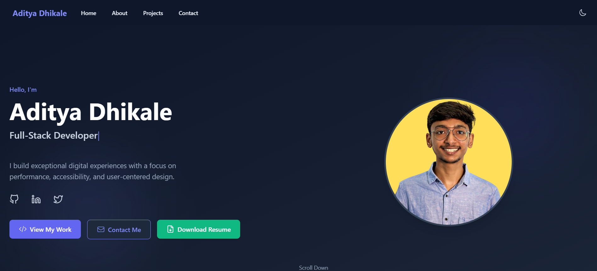

# Aditya Dhikale - Personal Portfolio

A modern, responsive personal portfolio website built with React and Vite to showcase my skills, projects, and expertise as a full-stack developer.

## 🌐 Live Demo

**Visit the live website:** [https://adityadhikale.netlify.app/](https://adityadhikale.netlify.app/)



## 🌟 Features

- **Responsive Design**: Fully responsive layout that works on all devices
- **Dark/Light Mode**: Toggle between dark and light themes
- **Interactive UI**: Smooth animations and transitions powered by Framer Motion
- **Dynamic Content**: Interactive sections for projects, skills, and contact information
- **Particle Background**: Interactive particle background effect
- **Type Animation**: Dynamic text typing animation on the hero section
- **Contact Form**: Functional contact form with validation
- **Social Media Integration**: Links to all professional social media profiles
- **Resume Download**: Option to download resume directly from the website

## 🛠️ Technologies Used

- **React**: UI library for building the front-end
- **Vite**: Fast build tool and development server
- **Tailwind CSS**: For styling and responsive design
- **Framer Motion**: For animations and transitions
- **TypeWriter Effect**: For text animations
- **tsParticles**: For the interactive particle background
- **React Scroll**: For smooth scrolling between sections
- **Heroicons**: For icons
- **ESLint**: For code linting

## 🚀 Getting Started

### Prerequisites

- Node.js (v14 or later)
- npm or yarn

### Installation

1. Clone the repository:
   ```bash
   git clone https://github.com/adityadhikale/portfolio.git
   cd portfolio
   ```

2. Install dependencies:
   ```bash
   npm install
   # or
   yarn install
   ```

3. Start the development server:
   ```bash
   npm run dev
   # or
   yarn dev
   ```

4. Open your browser and visit:
   ```
   http://localhost:5173
   ```

## 🔨 Building for Production

To build the app for production:

```bash
npm run build
# or
yarn build
```

The build files will be created in the `dist` directory.

## 🧪 Running Tests

```bash
npm run test
# or
yarn test
```

## 📝 Project Structure

```
/src
  /assets          # Images, fonts, and other static assets
  /components      # React components
    /shared        # Reusable components
    /Layout        # Layout components
  /sections        # Main page sections (About, Projects, etc.)
  /styles          # Global styles and Tailwind configurations
  /utils           # Utility functions
  App.jsx          # Main App component
  main.jsx         # Entry point
```

## 🔄 Deployment

This portfolio is currently deployed on Netlify. You can also deploy it on other platforms like:
- Netlify (current host)
- Vercel
- GitHub Pages
- Firebase Hosting

## 📄 License

This project is licensed under the MIT License - see the [LICENSE](LICENSE) file for details.

## 📧 Contact

Aditya Dhikale - adityadhikale03@gmail.com

Project Link: [https://github.com/adityadhikale/portfolio](https://github.com/adityadhikale/portfolio)

Live Website: [https://adityadhikale.netlify.app/](https://adityadhikale.netlify.app/)

---

Designed & Built with ❤️ by Aditya Dhikale
